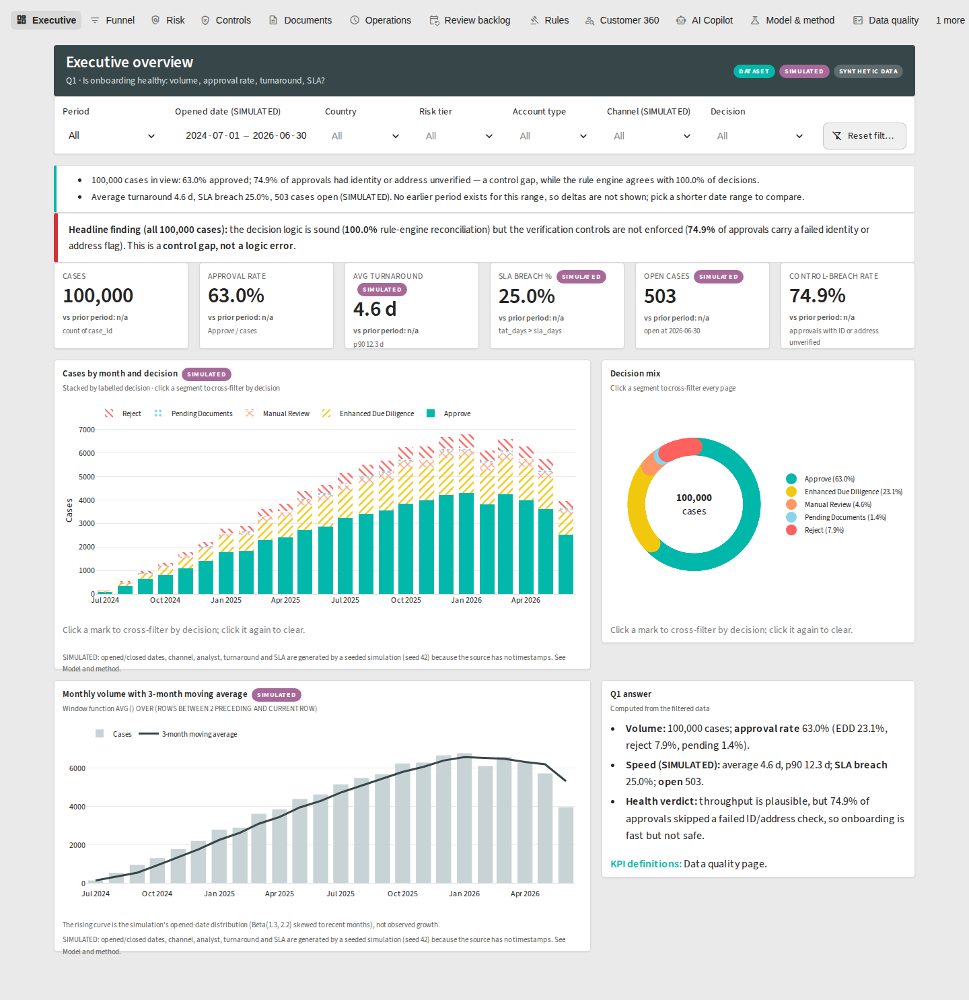
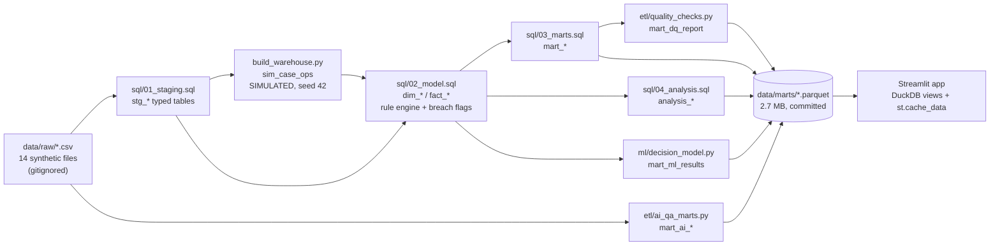

# KYC Onboarding Control Tower

[](https://github.com/GITHUB_USERNAME/kyc-onboarding-control-tower/actions/workflows/ci.yml)
[](https://kyc-onboarding-control-tower.streamlit.app)

[](LICENSE)

**Interactive KYC onboarding and control-assurance dashboard: SQL warehouse (DuckDB), rule-engine reconciliation, simulated SLA analytics, Streamlit UI.**



> **Headline finding (all 100,000 cases):** the decision logic is sound — the recovered rule engine reproduces **100%** of labelled decisions — but the verification controls are not enforced: **47,157 of 63,001 approvals (74.9%)** carry a failed identity or address flag. This is a **control gap, not a logic error**.

The live app sleeps after 12 hours without visitors on Streamlit Community Cloud; the first load after that shows a "wake up" screen and takes about a minute.

## The problem statement

**Title:** Client Onboarding & KYC Operations Dashboard: from onboarding speed to control assurance

**Problem.** A retail bank must verify every new client (identity, address, sanctions, politically exposed person status, risk tier and supporting documents) before opening an account. Operations leaders track how *fast* cases move; compliance leaders need to know whether decisions are *right*, follow policy, and whether the verification controls were actually passed. Today these views live in separate reports, so nobody can answer the questions that matter to both: where do applications stall, are decisions consistent with the AML rules, are customers being approved despite failed verification, is document verification reliable, and can analysts trust the AI assistant that drafts case answers?

**Solution.** One interactive dashboard over 100,000 synthetic onboarding cases that joins **operational efficiency** (funnel, turnaround, SLA, workload) with **control assurance** (policy reconciliation, control breaches, document quality, periodic-review backlog, AI-answer quality), backed by a tested SQL warehouse and a reproducible pipeline.

## Key findings (computed from the data)

| # | Question | Answer | Page |
|---|---|---|---|
| Q1 | Is onboarding healthy? | 100,000 cases, 63.0% approved (EDD 23.1%, reject 7.9%, manual review 4.6%, pending 1.4%). Average turnaround 4.6 d, p90 12.3 d, SLA breach 25.0%, 503 open cases — all **SIMULATED**. | Executive |
| Q2 | Where do customers drop out? | At policy gates, not process friction: PEP → EDD removes 18,475, High-risk escalation 9,223, sanctions 7,877, missing documents 1,424. Funnel 100,000 → 92,123 → 73,648 → 64,425 → 63,001. | Funnel |
| Q3 | Do decisions follow policy for 100% of cases? | **Yes: 100%.** Five rules in precedence order (sanction → PEP → High risk → fewer than 4 verified documents → approve) reproduce every label. | Controls |
| Q4 | Approved despite a failed check? | **Yes: 74.9% of approvals** (47,157): identity unverified 31,377 (49.8%), address unverified 31,461 (49.9%). 13,149 approvals (20.9%) had fewer than 5 verified documents, which policy allows. | Controls |
| Q5 | Are documents and periodic reviews under control? | Documents fail verification at 5.0% evenly across types; OCR confidence (0.80–0.99) does not separate failures. **50,620 customers (50.6%) are overdue for review**, including 18,101 High-risk, at the same rate in every risk tier. | Documents, Review backlog |
| Q6 | Can analysts trust the AI copilot? | Not on this evidence: 66.7% of 150,000 benchmark answers are hallucinated, flat at 66.5%–66.9% per question, and the answers collapse to 25 templates, so detector scores near 100% are an artefact. | AI Copilot |

A machine-learning model **cannot beat the policy**: with PEP, sanction and risk tier a gradient-boosting model reaches 95.5% (the rest is the unexplained EDD-vs-Manual-Review split); without them it scores 64.5% against a 63.0% majority baseline. See [Model and method](docs/methodology_and_limitations.md).

Every number above is recomputed from the marts by `tests/test_marts.py::test_readme_headline_numbers_are_backed_by_committed_marts`, and every fact from the original brief is re-verified in [docs/known_data_issues.md](docs/known_data_issues.md) (73 of 74 reproduced exactly; the one difference is explained).

## What is simulated and why

> The source data has **no case timestamps, analysts, channels or SLA fields**. To demonstrate operational analytics, `etl/build_warehouse.py` generates a **simulated operations layer** (`sim_case_ops`) with `numpy.random.default_rng(42)`: opened date (Beta(1.3, 2.2) over 730 days before 2026-06-30), analyst (24, uniform), channel (Web 40% / Branch 25% / Mobile 25% / Partner 10%), lognormal handling time by decision (× 1.35 High risk, × 1.25 PEP) and SLA targets by decision. It lives in its own table, every visual that uses it carries a purple **SIMULATED** pill and footnote, and the Model and method page lists every parameter. Decisions, flags, documents, rules and AI answers are **not** simulated: they come from the (synthetic) dataset.

## Architecture



Details: [docs/architecture.md](docs/architecture.md) · SQL features: [docs/sql_showcase.md](docs/sql_showcase.md)

## The 13 pages

| # | Page | What it shows |
|---|---|---|
| 1 | Executive overview | KPI cards with period-over-period deltas, cases by month × decision, cross-filtering decision donut, 3-month moving average, insight strip, headline finding, Q1 answer |
| 2 | Funnel and decisions | Funnel 100,000 → 63,001 with drop-off %, decision-reason bars, risk → decision Sankey, drop-off by country |
| 3 | Risk and screening | Country × risk heat matrix, PEP / sanction / High-risk rates by segment, income quintile by risk, explicit FLAT labels |
| 4 | Controls and compliance | Rule-engine agreement (100%), approvals with failed identity or address (74.9%), breaches by country and channel, trend, drill-through case table with capped CSV export |
| 5 | Documents and OCR | Fail rate by type, OCR-confidence histogram, low confidence by issuing country, cases with fewer than 5 verified documents |
| 6 | Operations and SLA (SIMULATED) | p50 / p90 turnaround trend, SLA breach trend, analyst league table with RANK(), workload heat map, open-case ageing |
| 7 | Periodic review backlog | Overdue % by risk tier and age band, overdue High-risk list, "reviewed in last 12 months" gauge |
| 8 | Rules and policy | Rules by category / jurisdiction / priority, 117 orphan rules, guideline timeline, keyword search |
| 9 | Customer 360 and what-if | Exact-ID search, profile card, 5 documents, rule path, additive risk score, simulated timeline, what-if simulator |
| 10 | AI Copilot quality | Hallucination by type, severity and question, detector confusion matrix with precision/recall, 25 masked examples, templating caveat |
| 11 | Model and method | The two ML experiments, permutation and SHAP importance, methodology, simulation parameters |
| 12 | Data quality and definitions | `mart_dq_report` scorecard (78 checks, 0 fail), claimed-vs-measured, KPI definitions, known issues, lineage |
| 13 | About | Problem statement, Q1–Q6 answers, author card, stack |

Power BI behaviour: a report-level **slicer bar** on every page (period, opened date, country, risk tier, account type, channel, decision) kept in `st.session_state`; **click-to-cross-filter** on bars and the donut; **drill-through** from any case table to Customer 360 in an `st.dialog`; **Reset filters**; rich hover tooltips; computed **insight strips**; `st.fragment` for search and what-if; every query cached.

## Tech stack

Python 3.11 · DuckDB (SQL warehouse, Parquet I/O) · pandas · NumPy · PyArrow · Plotly · Streamlit · scikit-learn and SHAP (dev only) · pytest · ruff · GitHub Actions. App runtime dependencies are only `streamlit`, `duckdb`, `pandas`, `plotly`, `pyarrow` (pinned in `requirements.txt`).

## Quickstart

```bash
make setup            # pip install -r requirements-dev.txt
# put archive.zip in the repo root, then:
make raw              # unzip into data/raw (gitignored)
make etl              # build the warehouse + marts (~30 s on the full data)
make ml               # two ML experiments -> data/marts/mart_ml_results.parquet (~30 s)
make app              # streamlit run app/streamlit_app.py
```

Without the raw data the app still runs: the marts in `data/marts` are committed. `make all` runs lint, the ETL and ML on the 1,000-customer sample, and the tests — it works from a clean clone.

## Repo tour

```
sql/        01_staging  02_model (rule engine, breach flags)  03_marts  04_analysis (advanced SQL)
etl/        build_warehouse.py (CLI + simulation)  ai_qa_marts.py  quality_checks.py  make_sample.py
ml/         decision_model.py (two experiments)  explain.py (permutation + SHAP with additivity check)
app/        streamlit_app.py  theme  components  data (one cached connection, parameterised SQL)
            kpis (every KPI once)  insights  state  views/01_executive.py … 13_about.py
tests/      rules, marts, KPIs, data quality, AppTest smoke (86 tests)
notebooks/  01_eda_and_findings.ipynb (executed)
docs/       architecture, data dictionary, KPI definitions, methodology, known issues, decisions,
            SQL showcase, interview Q&A, LinkedIn post, résumé bullets, demo script, screenshots
```

## Testing and CI

`pytest -q` runs 86 tests: rule reconciliation (SQL engine = Python engine = labels on every input combination), key uniqueness and lossless joins, `VerifiedDocuments` consistency, no approved sanctioned customer, simulation ordering and seed reproducibility, KPI functions on a hand-built fixture (and SQL snippets equal the Python functions), marts non-empty with expected columns and no PII columns, and a Streamlit `AppTest` that renders all 13 pages and proves a slicer changes the KPIs. Tests assert invariants, not full-data row counts, so they pass on the sample and on the full data. CI (`.github/workflows/ci.yml`) runs ruff, the ETL and ML on `data/sample`, pytest against that sample warehouse, and the AppTest smoke test against the committed marts.

## Data note

The dataset is **synthetic** (all names, IDs and documents are generated) and is **not redistributed** here: raw CSVs, OCR text and the `.duckdb` warehouse are gitignored. Only small aggregate Parquet marts (2.7 MB) and a deterministic 1,000-customer sample for CI are committed. See [data/README.md](data/README.md).

## Limitations

* Operational timing, analysts, channels and SLAs are simulated; they demonstrate the analytics, not real performance.
* The labels come from a deterministic rule engine, so ML cannot add predictive value; the ML page exists to prove that.
* The AI benchmark is templated; its detector scores do not generalise.
* Country, occupation, income and age carry no signal in this data, so segment analyses are (correctly) flat.
* Full list: [docs/methodology_and_limitations.md](docs/methodology_and_limitations.md) and [docs/known_data_issues.md](docs/known_data_issues.md).

## Roadmap

* Replace the simulation with real case-event timestamps (event log → true turnaround, queue time, rework loops).
* Move the warehouse to Postgres and the SQL to dbt models with dbt tests and exposures.
* Role-based access (operations vs compliance views, masked Customer 360 for non-privileged users) and audit logging.
* Make identity and address verification a hard gate in the rule engine and add a regression test for it.

## Author

**AUTHOR_NAME** · GitHub: [GITHUB_USERNAME](https://github.com/GITHUB_USERNAME) · LinkedIn: [LINKEDIN_URL](LINKEDIN_URL)

Licensed under the [MIT License](LICENSE).
