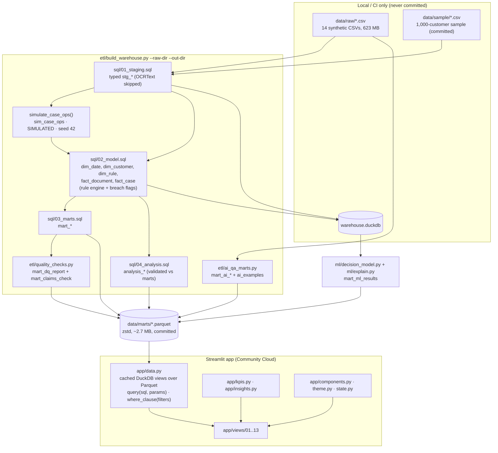

# Architecture

## Components

| Component | Responsibility | Why this design |
|---|---|---|
| `sql/01_staging.sql` | Typed, snake_case copies of the five core CSVs. Yes/No → BOOLEAN, `EffectiveDate` parsed as dd-mm-yyyy, OCRText never read. | One naming convention and type system for everything downstream; the raw path is injected by the orchestrator (`${RAW_DIR}`), validated and quote-escaped. |
| `etl/build_warehouse.py` | CLI (`--raw-dir`, `--out-dir`, `--db`), runs the SQL files statement by statement, builds `sim_case_ops`, validates the analysis queries against the marts, exports Parquet, runs quality checks, logs row counts and timings. | Idempotent (rebuilds the `.duckdb` from scratch) and deterministic (fixed seed, draws in `case_id` order). ~30 s on the full data. |
| `sql/02_model.sql` | Star schema; `fact_case` holds the labelled decision, the rule-engine decision and rule, `engine_agrees`, the four breach flags and the simulated fields. | The policy is expressed once in SQL and mirrored in `app/kpis.py`; tests prove the two agree on every input combination. |
| `sql/03_marts.sql` | 15 marts sized for the app: one row-level case mart (100k rows) plus small aggregates, rule/guideline text for search, and the 500k-row document mart for Customer 360 and filtered document visuals. | The app never touches raw data. Marts carry no names, dates of birth, document numbers or OCR text (tested). |
| `sql/04_analysis.sql` | Seven named analysis queries (FILTER, UNPIVOT, FIRST_VALUE, QUALIFY, GROUPING SETS, LAG, moving averages, RANK/DENSE_RANK/NTILE, ANTI JOIN). | Advanced SQL where it answers a business question; outputs are shown on the dashboard as "warehouse proof" tiles. |
| `etl/ai_qa_marts.py` | Masks customer IDs, aggregates hallucination by type, question and severity, runs a transparent reference-grounded detector on the 30 distinct masked answer pairs, ships ≤ 25 masked examples. | Raw answer text is never exported; the detector is rule-based so its ~100% score is explainable (templated data). |
| `etl/quality_checks.py` | 78 checks → `mart_dq_report` (pass/warn/fail) and 74 claimed-vs-measured facts → `mart_claims_check`. | Trust is shown, not asserted: the Data quality page renders both. |
| `ml/` | Two HistGradientBoosting experiments, permutation importance and SHAP (only if SHAP passes an additivity check). | Proves a model can only re-learn the policy. Dev-only dependencies. |
| `app/data.py` | One `st.cache_resource` DuckDB connection with a view per Parquet file; `query(sql, params)` cached with `st.cache_data`; `where_clause(filters)` returns `(sql, params)` with `?` placeholders. | All SQL goes through one function; user input is only ever a bound parameter. Each call uses its own cursor, which is thread-safe across sessions. |
| `app/state.py` | Canonical slicer values in `st.session_state["flt_*"]`, widgets in `w_*` keys synced by callbacks. | Filters survive page switches (widget state alone does not) and cross-filter clicks can write them directly. |
| `app/components.py` | Title band, slicer bar, KPI cards with coloured arrowed deltas, tiles, insight strip, SIMULATED pill, cross-filter charts, selectable donut, drill-through dialog, capped CSV export, Customer 360 renderer. | Consistent Power BI look; Plotly pie slices emit no selection events in Streamlit, so the donut is drawn from dense scatter markers on a ring, which are selectable. |
| `app/views/` | One module per page, registered with `st.navigation(position="top")`. | Each page is a readable script: header → insights → KPIs → tiles. |

## Runtime budget

The committed marts total ~2.7 MB (limit 25 MB). DuckDB reads Parquet lazily through views, and every query result is cached, so the app stays far below Streamlit Community Cloud's 2.7 GB memory ceiling. Measured locally with `AppTest`, all 13 pages render without exceptions; interactions after warm-up hit the cache.
